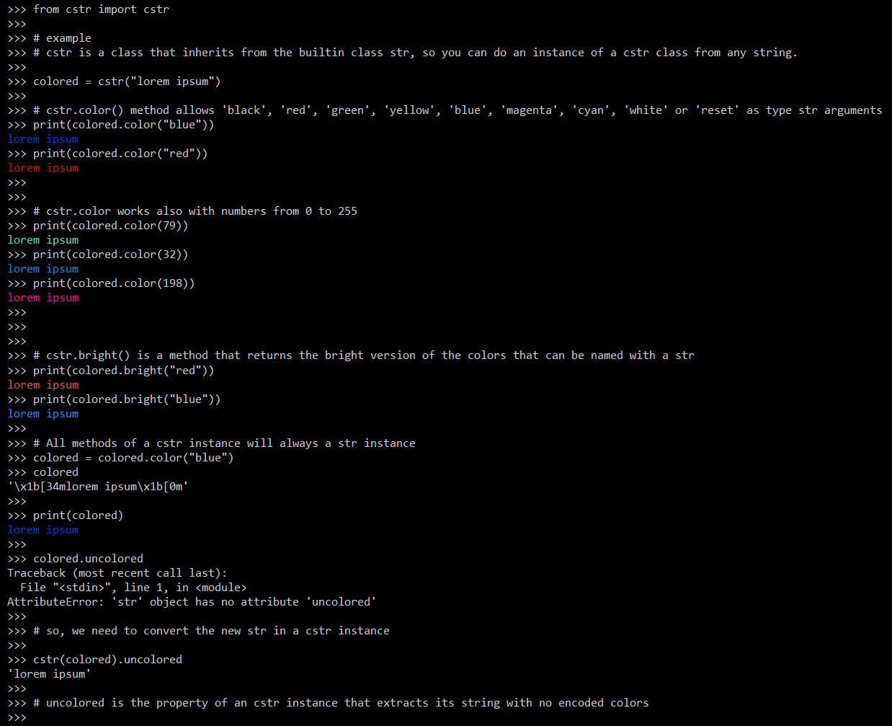

# CSTR Python module (Colored string)

## Description
A python module that allows you to print colored strings easily, in a human-readable format.

## Installation
Git clone this repository and move the `cstr.py` module to `/usr/local/lib/python3.x/dist-packages` if you want the module ready to use in all your projects you like.
Or move the `cstr.py` module to the project folder you like to add this.

## Usage

## Uninstall
Just delete the module from your project, or go to `/usr/local/lib/python3.x/dist-packages/` to remove it from all the projects.
